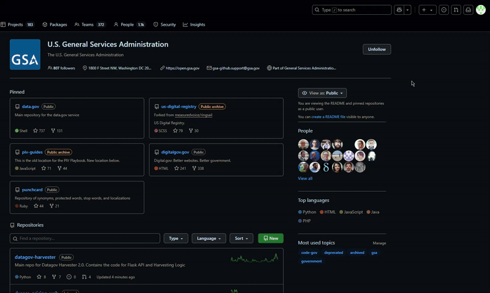
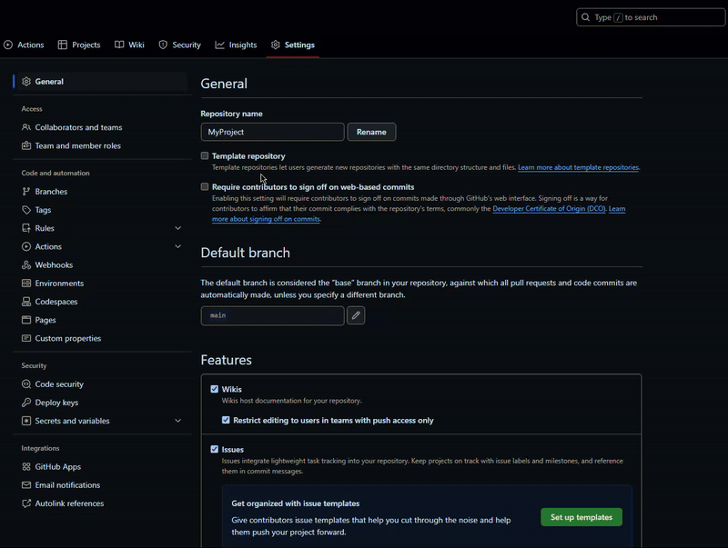

# Repository Setup Instructions

Follow the steps below **In Order** to create and configure the repository using the **poa-blank-template**.

---

## 1. Create the Repository

1. In GitHub, click the **+** icon in the top right corner and select **New repository**.
2. Under **Repository template**, select **poa-blank-template**.
3.  Check this option: **Include all branches**.
4. Ensure that the **Owner** to: `GSA` .
5. **Repository Name**: Name the repository appropriately. For example, you might name it `poa-docs` (you can rename it later if needed).
6. **Visibility**: Set the repository to **Private**.
7. (Optional) Check **Create a README file** if desired. Leave the rest of the options as-is.
8. Click **Create repository**.



----

## 2. Configure Repository Settings

### a. Set Up Collaborators and Teams

1. Navigate to the **Settings** tab of your newly created repository.
2. Under **Access** > **Collaborators and teams**, click on the **Add teams** button.
3. Add the following teams with their associated access levels:
   - **PO&A Team** – *Read*
   - **PO&A Dev Team** – *Write*
   - **PO&A Admin Team** – *Admin*
```c++
po-a
```
> [!TIP]
> *You can copy/paste `po-a` to quickly locate the teams.*


### b. Import Rulesets
First download this ruleset 
   - [Download asset](https://github.com/Orrin-GSA/Example/blob/main/assest/PO%26A_Default.json "download")

- <a href="C:\Users\liloh\Documents\Work\Instructions\assest\PO&A Default.json" download>Download the asset</a>

1. Go to **Code and automation** > **Rules** > **Rulesets**.
2. Click on **New ruleset**.
3. Select **Import a ruleset**.
4. Upload the attached JSON file and wait for it to load.
5. Once loaded, click **Save**.


### c. Remove Your Direct Access

> [!CAUTION]
> This step must be performed after importing the ruleset. Otherwise, you will not be able to add the rulesets. If you have not done this yet please do so!

1. Return to **Access** > **Collaborators and teams**.
2. Remove yourself from the direct access list.


   


----

## Final Notes

- Verify that all settings and permissions are correctly applied.
- If any issues arise, double-check the order of the steps, especially the removal of your own access after setting up the rulesets.


