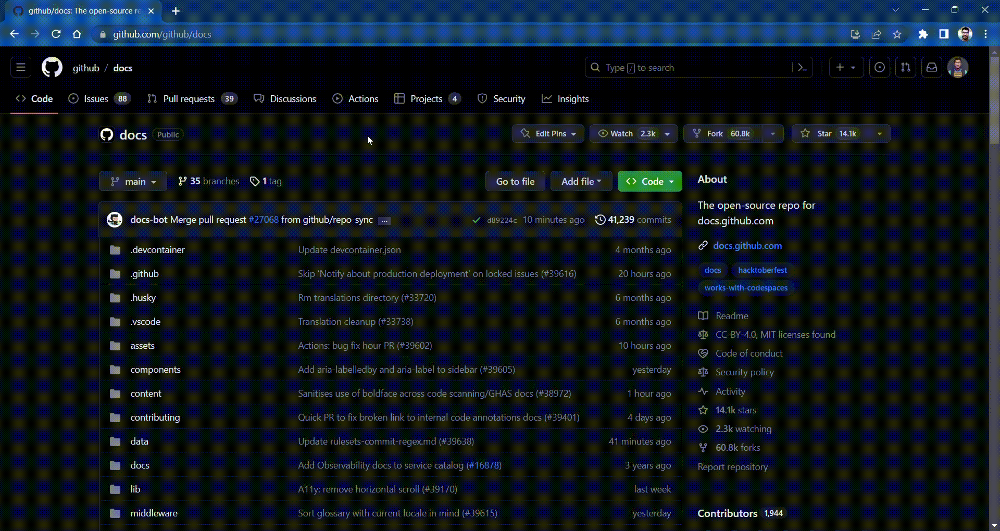
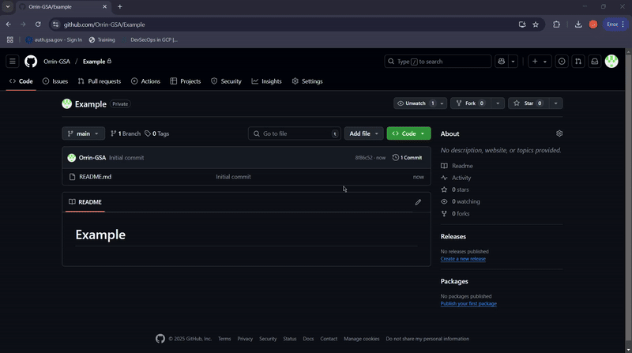
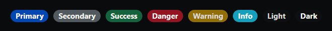

# Introduction

This project is a dashboard template that uses a JSON configuration file to define the table structure, columns, filters, and action buttons. The dashboard is rendered using React and React Bootstrap components. This README contains:
- **Installation guide**: Guide to clone the project, connect to clasp and publish project
- **User guide**: Guide to modify the configuration file to fit your project
- **Developer guide**: Guide to developers who wish to modify code and add features/updates (In progress)

<details>
<summary>Installation Guide</summary>

## Table of Contents

1. [Getting Started](#getting-started)
   - [1.1 Fork the Repository](#11-fork-the-repository)
   - [1.2 Clone the Repository to VS Code](#12-clone-the-repository-to-vs-code)
   - [1.3 Open the Cloned Repository](#13-open-the-cloned-repository)
2. [One-time Setup Instructions](#one-time-setup-instructions)
   - [2.1 Install Node.js LTS](#21-install-nodejs-lts)
   - [2.2 Install Clasp Globally](#22-install-clasp-globally)
   - [2.3 Log into Clasp](#23-log-into-clasp)
3. [Install Dependencies](#3-install-dependencies)
4. [Connect to Clasp](#4-connect-to-clasp)
5. [Run in Development Mode](#5-run-in-development-mode)
6. [Publish to Google Apps Script](#6-publish-to-google-apps-script)
   - [Dev Publishing](#dev-publishing)
   - [Prod Publishing](#prod-publishing)
7. [Creating a Deployment in Google Apps Script](#7-creating-a-deployment-in-google-apps-script)


## Getting Started

Follow these steps to set up and run the application locally.

### 1.1 Fork the Repository

To begin, you need to fork the repository to your own GitHub account. This allows you to make your own modifications and manage your version of the project.

- Navigate to the [repository's GitHub page](https://github.com/GSA-RPA/dashboard-template).
- Click on the **Fork** button in the upper right corner of the page.
- Select your personal GitHub account or organization where you want to fork the repository.




Once the fork is complete, you'll have your own copy of the repository under your GitHub account.

### 1.2 Clone the Repository to VS Code

After forking the repository, the next step is to clone it to your local machine for development using the following steps:

1. Open [VS Code](https://code.visualstudio.com/) on your machine.
2. Open the **Terminal** inside VS Code by going to `View > Terminal` or pressing `Ctrl + `.
3. Use the `git clone` command to clone your forked repository to your local machine. Run the following command:

```bash
git clone https://github.com/username/repository-name.git
```
4. Navigate into the cloned repository:

```bash
cd your-repository-name
```
or alternatively you can clone with GitHub Desktop

**Clone the Repository**  
   Once you have forked the repository, you can clone it using GitHub Desktop:
   - In GitHub click, **Code** .
   - In the **Code** dropdown, click on the **Open with GitHub Desktop** this will launch GitHub Desktop.
   - This will prompt to Clone a repository  Click on the **Clone** button.

   GitHub Desktop will now clone the repository to **...\GitHub\repository-name.**



### 1.3 **Open the Cloned Repository**  
   Once the repository has been cloned, GitHub Desktop will automatically open the project. If you want to open it in your code editor (such as VS Code), click on `Repository` > `Open in Visual Studio Code` or manually open the folder.


## 2. One-time Setup Instructions

Before installing dependencies, follow these steps to set up your environment:

### 2.1 **Install Node.js LTS**  
   Visit [Node.js official website](https://nodejs.org/en/) and download the LTS version.

### 2.2 **Install Clasp Globally**  
   Run the following command to install `clasp` (Google Apps Script CLI tool) globally on your system:

```bash
npm install -g @google/clasp
```
### 2.3 Log into Clasp
To authenticate clasp with your Google account, run:

```bash
clasp login
```

This will prompt you to sign in to your Google account. Follow the instructions to authenticate and grant the necessary permissions.
Once logged in, the configuration will be saved in a file named `.clasp.json` in your project directory. This file links your local project with the Google Apps Script project.

### 3. Install Dependencies

Once you have cloned the repository, you need to install the project dependencies to run the application. This can be done using **npm**, the Node.js package manager.

1. Open the terminal in the root directory of the cloned repository (if you’re not already there).
2. Run the following command to install all the required dependencies:

```bash
npm install
```

This command will install all the necessary libraries and packages defined in the `package.json` file. Once the installation is complete, you’re ready to start running and developing the application.

Now, you can proceed to the next steps to connect to Clasp and start the application in development mode.


### 4. Connect to Clasp

Connect to Clasp (Google Apps Script command line tool). This step is required only once per machine.

1. First, follow the instructions in the **One-time Setup Instructions** section above to install Node.js, install clasp globally, and log into clasp.

2. After the one-time setup, run the following command to link your project to Google Apps Script:

```bash
npm run gin
```

Or, alternatively you can connect this to your Google App Script by running: 

```bash
clasp login
```
This will prompt you to log in to your Google account and authorize the necessary permissions.
The connection configuration will be saved in the .clasp.json file located in the root of your project directory `(C:\Users\MyComputer\....\GitHub\dashboard-template\.clasp.json)`.

Configure `.clasp.json`
Ensure your `.clasp.json` file is properly configured. It should look like this:

```json
{
"scriptId": "My_Google_App_Script_ID",
"rootDir": "./dist"
}
```
Add your script id (found in the script url) to the scriptId property. This links your local project to the Apps Script project.
For more information about using Clasp and its commands, visit the official Clasp documentation: [Clasp GitHub Repository](https://github.com/google/clasp).

### 5. Run in Development Mode

To start the development server within the terminal, run:

```bash
npm run devlocal
```

This command will:
- **Clear** the Parcel cache (see Parcel React Setup for details).
- **Start** the front-end development server on http://localhost:1234.
- **Launch** the server on http://localhost:1235.
- **After** running, open http://localhost:1234 in your browser to see the application in action.


### 6. Publish to Google Apps Script

#### Dev Publishing
To publish your project to the Google Apps Script development environment, use the following command:

```bash
npm run publish_dev
```
What this command does:

**Clean**: Removes any previous build artifacts.
**Build**: Compiles your local code.
**gpush**: Pushes the compiled code to your Google Apps Script project.
This command simplifies the process for development and ensures the correct files are deployed to your Google Apps Script project.


#### Prod Publishing
For publishing your code to the production environment, use the `publish_prod` command:

```bash
npm run publish_prod
```
What this command does:

**Clean**: Removes any previous build artifacts.
**Build**: Compiles your local code.
**gpush**: Pushes the code to Google Apps Script.
**Redeploy**: Deploys your code to production.

Before using this command, make sure to update the `deploymentId` in `src_dev/publishProd.js`. The `deploymentId` is essential for identifying which deployment to update. Here’s how to do it:

Go to your Google Apps Script Project.
Create a new deployment by clicking on **Deploy** > **Test deployments** or **New deployment**.
Copy the generated deployment ID from the deployment settings.
Then, update `src_dev/publishProd.js` with the correct `deploymentId`:

```javascript
const deploymentId = "DEPLOYMENT_ID"; // Update this with your actual deployment ID
```

Note: The webapp URL is constructed using the deploymentId: `https://script.google.com/a/macros/gsa.gov/s/${deploymentId}/exec`

### 7. Creating a Deployment in Google Apps Script
To create a deployment within Google Apps Script:

1. Go to your Google Apps Script Dashboard.
2. Click on Deploy in the top-right corner.
3. Select New deployment and follow the steps to configure your deployment (e.g., as a web app).
4. After saving the deployment, copy the Deployment ID from the Deployment settings.

This ID will be used in the `publishProd.js` script to identify the specific deployment.

</details>
<details>
<summary>User Guide</summary>

## Table of Contents

1. [Overview](#overview)
2. [JSON Configuration File (dbConfig.json)](#json-configuration-file-dbconfigjson)
    a. [Title](#title)
    b. [Metadata and Column Definitions](#metadata-and-column-definitions)
        - [Columns](#columns)
        - [Action Columns](#action-columns)
        - [Badge Columns](#badge-columns)
    c. [Filter Mappings and Default Filters](#filter-mappings-and-default-filters)
    d. [Table Operation Features](#table-operation-features)
    e. [Optional Actions](#optional-actions)
        - [Export](#export)
        - [Intake Form](#intake-form)
3. [Server-side Configuration File (Main.js)](#serverside-configuration-file-mainjs)
    a. [File IDs](#file-ids)
    b. [Features/Functions](#featuresfunctions)
        - [getData](#getData)
        - [exportData (Optional)](#exportdata-optional)
    c. [User Roles & Admin Access (Optional)](#user-roles-admin-access-optional)
        - [Admin Access](#admin-access)
        - [User Roles](#user-roles)
4. [Updating dbConfig.json file](#updating-dbconfigjson-file)
a. [Publishing to Google Drive](#publishing-to-google-drive)
b. [Retrieving from Google Drive](#retrieving-from-google-drive)


## Overview

This project template allows you to deploy a React-based front end that serves content via Google Apps Scripts. It is structured to separate concerns, facilitate local development, and share code across different parts of the application.

To customize your dashboard, modify the `dbConfig.json` file.

## JSON Configuration File (dbConfig.json)

Below is a breakdown of the JSON configuration file that drives the dashboard settings and layout:


### Title
The dashboard title is defined in multiple locations:

1) **dbConfig.json**
Modify the `dashboardTitle` string to display your custom dashboard title
```json
"dashboardTitle": "Sample Dashboard"
```

2) **index.html**

```html
<title>DASHBOARDTITLE</title>
```

### Metadata and Column Definitions
The `metadata.columns` array defines the columns for the main table:

```json
"metadata": {
    "columns": [
        {"name": "First Name", "title": "First Name", "size": "150", "filterType": "select"},
        {"name": "Last Name", "title": "Last Name", "size": "110"}
    ]
}
```

Each column object specifies:
- `name`: (Required) The data key - has to match the column header in the source datatable.
- `title`: (Required) The display title for the column.
- `size`: (Required) Column width (in px).
- `filterType`: (Optional) The type of filter to apply (e.g., select, multiselectArr, multiselect). If not specified, filtering will not be present for the column

Types of filters:
- `select`: single select dropdown
- `multiselect`: multi-select dropdown when there is a single value
- `multiselectArr`: multi-select dropdown when input is an array
eg. Restaurants: ["Chipotle","Moes","McD"]


Additional column types provided:

Action Columns:
- Info column: viewing transaction details and taking actions. Toggle this functionality by modifying the `enabled` property. Once enabled, clicking on the info icon will take you to the details page of that transaction.

```json
    "actionColumns": {
        "info": {
            "enabled": true,
            "id": "info",
            "header": "Info",
            "buttonVariant": "outline-primary",
            "size": 70,
            "enableSorting": false,
            "action": "details"
        }
    }
```
Badge Columns:
- Status column: Display statuses using colored badges. Toggle this functionality by modifying the `enabled` property.

```json
    "badgeColumns": {
        "status": {
            "enabled": true,
            "id": "status",
            "header": "Status",
            "size": 100,
            "enableSorting": true,
            "filterType":"multiselect"
        }
    }
```

To define the status column badges, modify the `statuses` property.

```json
    "statuses":[
        {"label":"<<Status0>>","id":0,"type":"danger"},
        {"label":"<<Status1>>","id":1,"type":"warning"},
        {"label":"<<Status2>>","id":2,"type":"info"},
        {"label":"<<Status3>>","id":3,"type":"primary"},
        {"label":"<<Status4>>","id":4,"type":"success"},
        {"label":"<<Status5>>","id":5,"type":"secondary"},
        {"label":"<<Status6>>","id":6,"type":"dark"}
    ],
```
For more information about the different badge styles, visit the [React Bootstrap documentation](https://react-bootstrap.netlify.app/docs/components/badge/#contextual-variations)

#### Filter Mappings and Default Filters
```json
"filterMappings": {
        "multiselect": "multiselect",
        "select": "includesString",
        "multiselectArr": "multiselectArr"
    },
    "initialColumnFilters": [
        {
            "id": "First Name",
            "value": "Adam"
        }
    ]
```
- `filterMappings`: Maps the filter types defined in the metadata to filtering functions.
- `initialColumnFilters`: Sets default filters when the table is first rendered. id property needs to match the name property of the column object. value object contains a key value pair of the default filter value

### Table Operation Features 
The `actionButtons` array configures the interactive buttons available above the table. We provide 3 default actions:
- `instructions`: Displays a popover with instructions.
```json
{
    "id": "instructions",
    "type": "info",
    "variant": "outline-primary",
    "tooltip": "Instructions",
    "popoverHeader": "Instructions",
    "popoverBody": ["instructions"],
    "placement": "bottom"
}
```
- `clearFilters`: Clears all active filters for the main datatable.
```json
{
    "id": "clearFilters",
    "type": "clear",
    "variant": "outline-primary",
    "tooltip": "Clear all filters"
}
```
- `columns`: Dropdown for Column Visibility: Allows the user to toggle the visibility of columns not excluded by the configuration for the main datatable.
```json
{
    "id": "columns",
    "type": "dropdown",
    "variant": "outline-primary",
    "label": "Columns",
    "enabled":true
}
```
- The `search` feature filters the main datatable for rows containing the search text


### Optional Actions
Here are a list of optional actions that can be implemented in the dashboard:

- `export`: (Optional) Exports visible data to a Google Sheet or Excel specified by the `dataExportType` property (gsheet / excel). To turn off functionality, set `enabled` to `false`.

```json
{
    "id": "export",
    "type": "export",
    "variant": "outline-primary",
    "dataExportType": "gsheet",
    "fileName": "ExportFileName",
    "enabled": true    
}
```
In addition, the `excludedColumns` property will exclude any columns listed regardless of column visibility settings.
```json
"excludedColumns": ["search"]
```

- `intakeForm`: (Optional) If there is a form that feeds transactions to this dashboard, add the url to the `url` property. This generates a button that will open the form in a separate tab when clicked. To turn off functionality, set `enabled` to `false`.

```json
{
    "id": "intakeForm",
    "type": "link",
    "variant": "outline-primary",
    "tooltip": "Intake Form",
    "label": "Intake Form",
    "url": "formURL",
    "target": "_blank",
    "enabled":true
}
```

## Server-side Configuration File (Main.js)
Main.js contains server-side code of getting data from and writing data to Google

### File IDs
We provide several default connections to several google sheets. Populate these fields to connect your data to the dashboard:

```
const dashboardTitle = ""
const databaseID = "";
const databaseSheetName = "";
const logFileFolderID = "";
const logSheetID = "";
const dataSheetID = "";
const adminSheetName = ""
const userListSheetName = ""
const dataExportFolderID = "";
const configSheetID = "";
const ccEmails ="rpaoffice@gsa.gov"
```
- `dashboardTitle` name of the dashboard
- `databaseID` Sheet ID containing data that feeds the main table
- `databaseSheetName` Sheet Name containing data that feeds the main table
- `logFileFolderID (Optional)` Folder ID to store server-side dashboard activity logs as .txt. Files are named: `{dashboardTitle} {functionName} {user}_{date}.txt`
- `logSheetID (Optional)` Sheet ID to store client-side dashboard logs. The table will need to have these columns: [Date,User,Action,{Unique Identifier}]. Logs are shown in the history table in the details page.
- `dataSheetID` Data sheet containing user access data, additional data 
- `adminSheetName` (Optional) Sheet Name containing a list of admin users
- `userListSheetName` (Optional) Sheet Name containing user access data
- `dataExportFolderID (Optional)` Folder ID to store exported data as google sheets
- `configSheetID (Optional)` File ID of dbConfig.json
- `ccEmails` A string of emails to be copied on any correspondence/error emails. rpaoffice@gsa.gov is provided as default. We recommend appending the developer email.

### Features/Functions

#### getData
The `getData` function reads in data needed to populate the dashboard. We provide 3 default connections:

a. inputData: this is the data that feeds the main table
b. dbConfig: this is the dbConfig.json file
c. logs: this is the log data that will be shown in the history table in the details page. The logs are presorted newest to oldest.

Add code to sort / manipulate data here.

#### exportData (Optional)
The `exportData` function exports the main table to a google sheet housed in the `dataExportFolderID` folder. No modifications are needed.

### User Roles & Admin Access (Optional)
We provide functionality to define user roles and access to this dashboard. If there is only one role, use the admin access feature. If there are distinctions between user and admin roles, please use both the user roles and admin access feature.

Modify these variables to toggle this functionality:

```
const userRoles = true
const adminRoles = true
```

#### Admin Access 
If there is only one role, add user emails to Column A in the sheet named `adminSheetName` in  `dataSheetID`. Users that do not have their emails on this list will not be able to access the dashboard, and will see "Access Denied" when visiting the dashboard URL.

Access is cached for 24 hours. To update the admin cache manually, run the `updateAdminCache` function. This function will cache all emails listed as admins.

#### User Roles
For multiple user roles, you will need to modify several functions:

1. **`getUserAccess` function**

This function caches user access. We provide an example of user access by region, recording the user's email, supervisor email and region. You will need to modify this json to capture relevant user access info.

```
const cachedJSON = {
      "Employee Email": "",
      "Supervisor Email": "",
      "Region": ""
    };
```

If the user has access, we return `cachedJSON` with filled-in values, otherwise we return `cachedJSON` without any values. 

2. **`doGet` function**

This function queries user access and returns the dashboard if the user has access. We provide an example of determining user access by region. You will need to modify this if statement to control user access to the dashboard.

```
if (access.Region=="" && !isAdmin){
return HtmlService.createHtmlOutput("<b>Access Denied</b>");
}
```
If the user has access to the dashboard, this next section provides a guide on only returning data that is relevant to the user.

3. **`getData` function**

This function returns data to populate the dashboard. We provide an example of filtering input data by user roles:

1. If user is admin, we return all data
2. If user's region is not "National", return filtered data from user's region
3. Else if user's region is "National", return all data

You will need to modify this if-else code block to only return data that is relevant to the user.

```
// EXAMPLE PROVIDED. MODIFY FUNCTION TO FILTER DATA ACCORDING TO USER ACCESS
if (isAdmin) {
    Logger.log("Admin");
    return inputData;
} else if (access.Region != "National") {
    Logger.log("Region " + access.Region);
    let filteredInputData = inputData.filter(row => row.region == access.Region);
    Logger.log(JSON.stringify(filteredInputData));
    return filteredInputData;
} else {
    Logger.log("all data");
    return inputData;
}
```

Access is cached for 24 hours. To update the user cache manually, comment out the following lines in the `getUserAccess` function:

```
if (cached != null) {
    return JSON.parse(cached);
}
```
Commenting out these lines will force the code to query user access regardless of whether it was cached.


## Updating dbConfig.json file
Users cloning this repo will typically modify the dbConfig.json file in Google Drive. However, if there is a need to test code locally, we provide two commands to push and get dbConfig.json file from Google Drive.

There are 3 parameters needed:

`oauthToken` This string token can be obtained by running this line of code in google apps script: `Logger.log(ScriptApp().getOAuthToken())`
`dbConfigFileID` This is the file id of the dbConfig.json file in Google Drive
`dbConfigFolderID` THis is the folder id that houses the dbConfig.json file in Google Drive

Update these parameters in these 2 files:
`uploadDbConfig.js`
`downloadDbConfig.js`

### Publishing to Google Drive
Run the following command:

```bash
npm run pushconfig
```

This command will update the dbConfig.json file contents in Google Drive with that of your local file.

### Retrieving from Google Drive
Run the following command:

```bash
npm run pullconfig
```

This command will replace your local dbConfig.json file contents with that of in Google Drive

</details>

<details>
<summary>Developer's Guide</summary>

## Table of Contents

1. [Project Structure](#project-structure)
   - [src_scripts/](#src_scripts)
   - [src_react/](#src_react)
   - [src_dev/](#src_dev)
   - [src_shared/](#src_shared)
2. [Shared Constants](#shared-constants)
3. [Dynamic Column Generation](#dynamic-column-generation)
4. [Table Instance with React Table](#table-instance-with-react-table)
5. [Context and State](#context-and-state)


## Project Structure

The application is organized into the following sub-folders:

- **`src_scripts/`**  
  Contains the published Google Apps Scripts code. This code serves the React app to users.

- **`src_react/`**  
  Contains all of the code for the front-end React application.

- **`src_dev/`**  
  Contains a mock API that approximates the responses from Google Apps Scripts. This is used when running `npm run devlocal`.

- **`src_shared/`**  
  Contains code that is shared between the `src_react/` and `src_dev/` directories.

## Shared Constants

Within the application, several lists are maintained as predefined strings. Instead of manually writing these strings throughout the code, we create enum-like objects at runtime, which are then referenced as needed. These are stored in the file:  
**`src_shared/AppConstants.ts`**

> **Note:**  
> - The `id` field in these objects is used for database storage and data comparisons.  
> - The `title` field is used for display purposes, allowing you to change the display name without affecting the stored values.

## Dynamic Column Generation
- **Dynamic Columns**: Based on the `metadata.columns` array from `dbConfig`, the component creates dynamic columns using `createColumnHelper` from `@tanstack/react-table`.

Each column is configured with properties such as:
- `Header`: Display title.
- `Cell Renderer`: How data should be rendered. For example, if the cell value contains a JSON array (identified by "["), it is parsed and rendered as a list.

- Popover and Tooltip Integration: Uses React Bootstrap’s `OverlayTrigger` and `Tooltip` components for providing context-based help (e.g., instructions popover).

## Table Instance with React Table
The table instance is created with `useReactTable` which integrates:
- **Filtering and Sorting**: Client-side filtering, sorting, and faceting.
- **Pagination and Global Search**: Controlled using states like `globalFilter` and `columnFilters`.
- **Column Visibility**: Configurable via a dropdown menu.
The table instance provides methods to extract visible data and filtered rows for actions like exporting.


## Context and State
The component consumes configuration and data from `AutomationsContext` (which includes `inputData`, `dbConfig`, and a loading flag `isLoaded`).
It uses React hooks to manage states such as:
- `carouselIndex` for carousel control.
- `globalFilter`, `columnFilters`, and `sorting` for table filtering and sorting.
- `columnVisibility` to manage the visibility of specific columns.
- `exportVisible` to control the display of the export button.

</details>